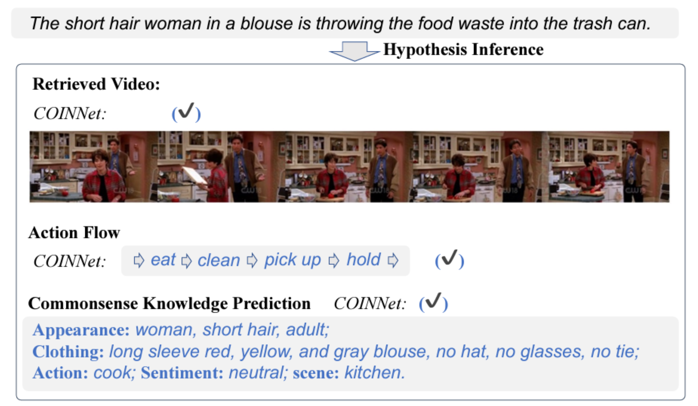

Code and Dataset for our paper 
"Cross-modal Observation Retrodiction Reasoning".

## Running Code

python -m torch.distributed.launch --nproc_per_node=4 --epochs=50 --lr 1e-4 --batch_size=128 

## Dataset Introduction

The Cross-modal Observation hypothesIs iNference task (COIN) aims to explain the textual observation by predicting an event chain (cause), which contains two sub-tasks: (A) retrieving the video from a video pool as the event chain starting point; (B) predicting the subsequent action flow after the retrieved video to complete the event chain. Towards two subtasks, there are two characteristics of our COIN task: Heterogeneous Alignment for Inference and Action Flow Inference. To promote the development of this field, we propose a large-scale dataset, Tex-COIN. The dataset consists of about 10,000 carefully collected videos, with 39,796 hypothesIs inference samples meticulously annotated by annotators with strong logical abilities. Our Tex-COIN dataset contains the following targeted designs: (1) Commonsense Knowledge Annotation. We have incorporated a diverse range of commonsense knowledge annotations pertaining to the video characters described by the textural observation. These annotations, covering aspects such as appearance, attire, actions, and emotional state, are aimed at enhancing the model's heterogeneous alignment of retrieved video and textural observation. (2) Action Flow Annotation. Each task example is annotated with a textual observation, and the sequence of actions that transpire post the video event and preceding the textual observation. In addition, the Tex-COIN dataset has the potential to advance broader task evaluations, such as temporally displaced text-to-video retrieval, thereby fostering deeper understanding and development in this area.


## Annotation File Format
The file format of the COIN task annotations is shown in the following:
```json
{
    "Video_2":{  // video index
        "person 2":{  // person numbering, 
            "description 1":{  // example description numbering
                "The short hair woman in a blouse is throwing the food waste into the trash can."  // textual observation
                [
                    "eat",  // action flow
                    "clean",
                    "pick up",
                    "hold"
                ],
                [
                    "cook", 
                    "None"    // video action
                ]
            }
        }
    }
}
```

## Case Study

In the shown case, the complete event process is: The woman cooked in the kitchen. → She ate the food. → She cleaned the kitchen waste. → She picked up, held, and threw the food waste. It can be observed our strong baseline, COINNet, precisely predicts the target video and the action flow, and reasons out all commonsense knowledge correctly, proving the reasonable design of our COINNet.




